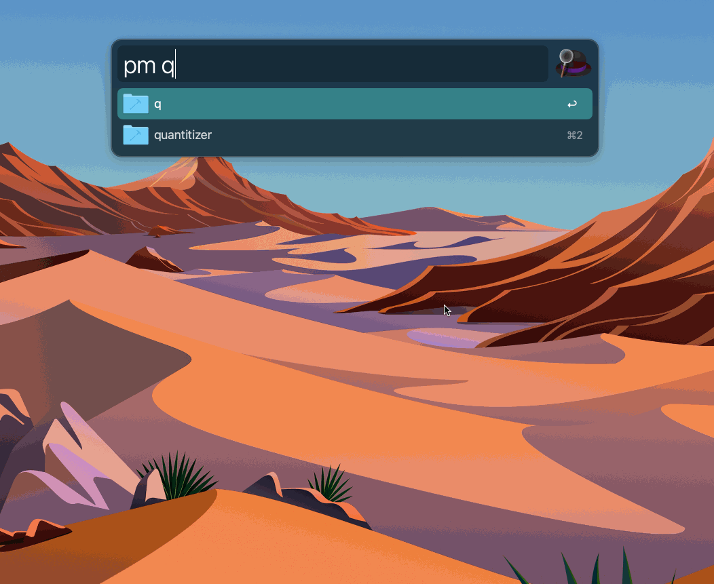

# Alfred Project Manager

Alfred Project Manager allows you to open your projects very easily.  

## Usage
```
pm <name_of_folder_with_project>
```



**Note:** Opening files in fullscreen mode requires to hold command button.

## Installation
1. Import the `.workflow` file in your Alfred.
2. Set the variable `PROJECT_DIR` (the workflow's environment variables).
3. Enjoy.

